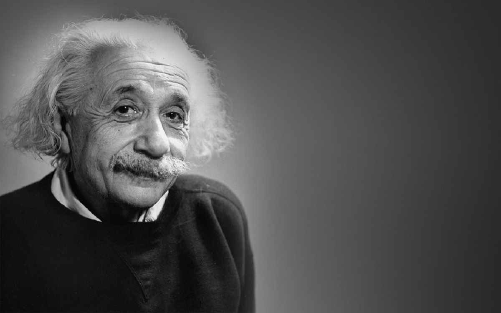
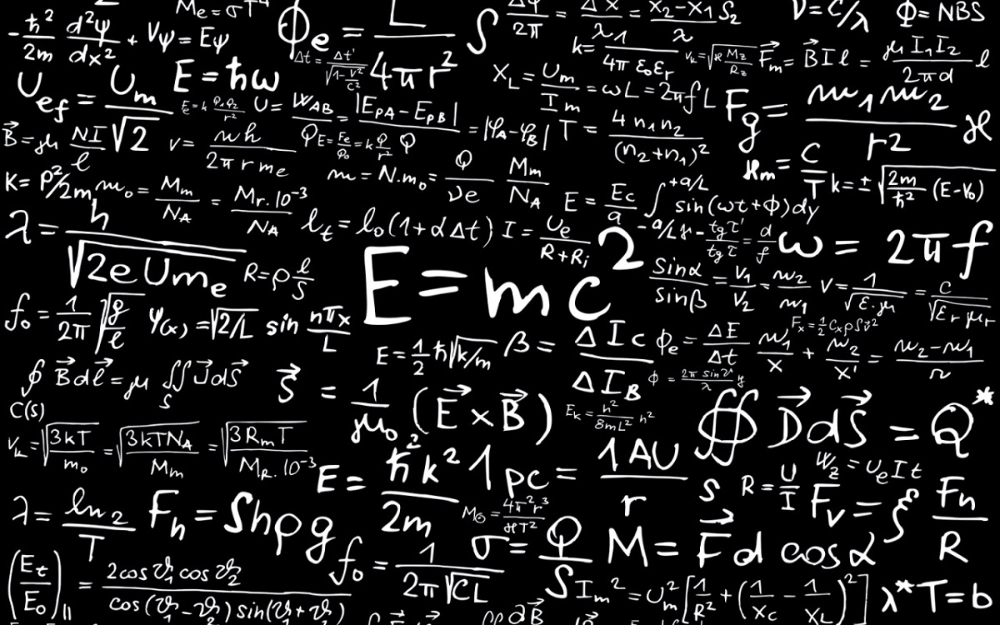
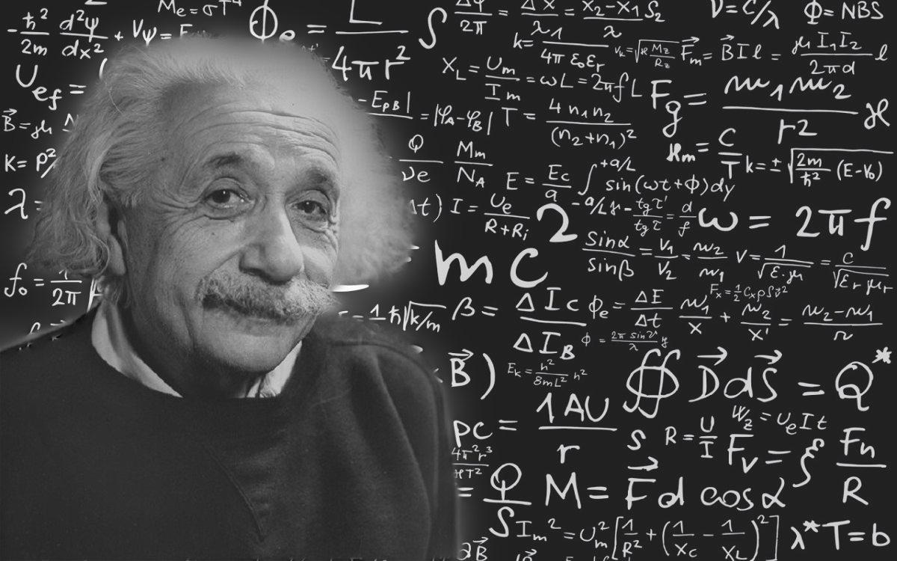

# pyramid_blending

This project is about pyramid blending, where two images are blended using pyramid blending algorithm.

In order to run the code:
	1) save your images as black.jpg and white.jpg according to black and white portion of the mask.
	2) run main.py
	

##Input images can be stored in ./resources/source directory

## the output is generated in ./resources/outputs directory

